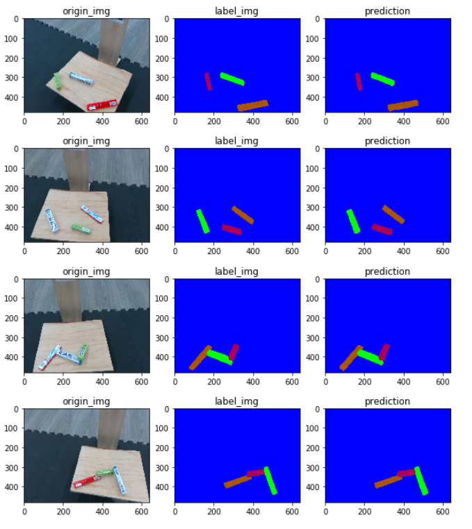
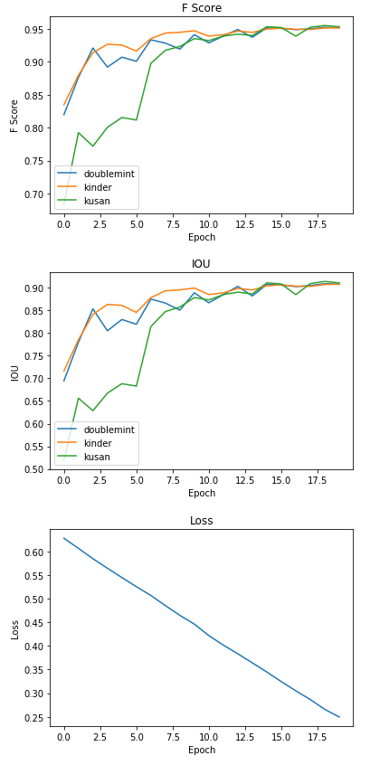
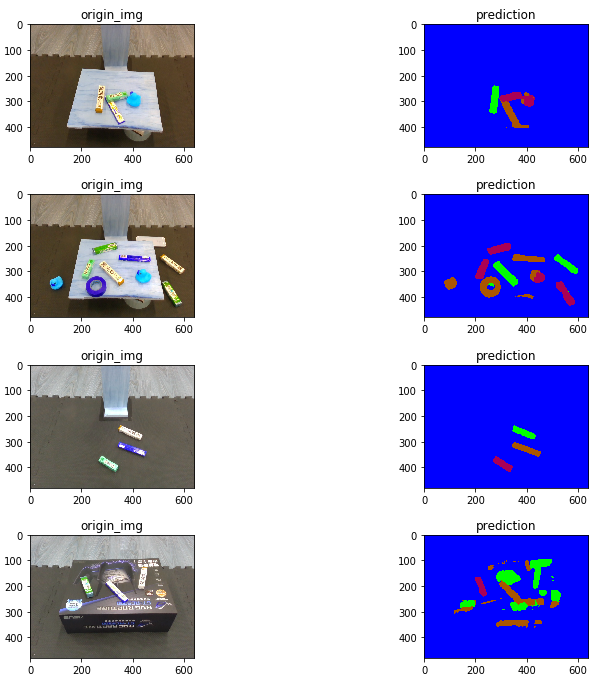

# Pytorch-FCN
Fully Convolutional Network


## Overview
This project shows how simple FCN works on object classification and location.


## Implementation

### 0. Download the dataset

tpye the commands on your terminal
```console
foo@bar:~$ gdown --id 1g72pkJapbS7w02MvNFIyOFP2Vn2bXDqR
foo@bar:~$ tar -xvf lab12.tar.gz
foo@bar:~$ jupyter notebook sis_fcn_mini_competition.ipynb
```


<td>


</td>

Some pictures show in weird color, I will fix it.

<td>

</td>
